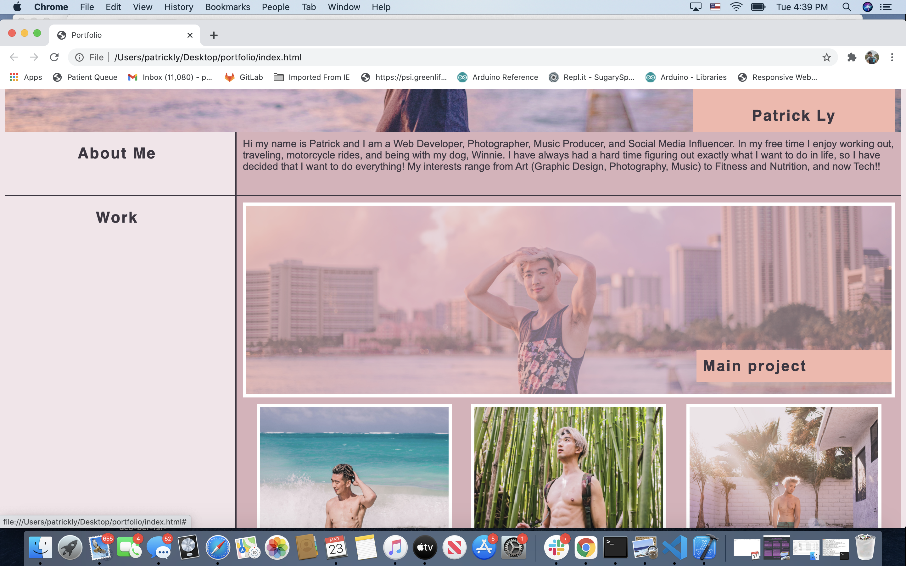

# Portfolio

## User Story
**AS AN** employer<br>
**I WANT** to view a potential employee's deployed portfolio of work samples<br>
**SO THAT** I can review samples of their work and assess whether they're a good candidate for an open position
<hr>

## Acceptance Criteria
**GIVEN** I need to sample a potential employee's previous work<br><br>
**WHEN** I load their portfolio<br>
**THEN** I am presented with the developer's name, a recent photo, and links to sections about them, their work, and how to contact them<br><br>
**WHEN** I click one of the links in the navigation<br>
**THEN** the UI scrolls to the corresponding section<br><br>
**WHEN** I click on the link to the section about their work<br>
**THEN** the UI scrolls to a section with titled images of the developer's applications<br><br>
**WHEN** I am presented with the developer's first application<br>
**THEN** that application's image should be larger in size than the others<br><br>
**WHEN** I click on the images of the applications<br>
**THEN** I am taken to that deployed application<br><br>
**WHEN** I resize the page or view the site on various screens and devices<br>
**THEN** I am presented with a responsive layout that adapts to my viewport<br><br>
<hr>

## Description

1) **WHEN** I load their portfolio<br>
**THEN** I am presented with the developer's name, a recent photo, and links to sections about them, their work, and how to contact them<br><br>

What I did here was add my photo as the main ```<section>``` of the page, created a ```<nav>``` section with anchor links to my about me, work, and contact information. 

2) **WHEN** I click one of the links in the navigation<br>
**THEN** the UI scrolls to the corresponding section<br><br>

What I did here was created each section with an attribute in the html tags and then called the ID in the anchor tags so that when clicked the Ui scrolls to the correspondind section.

3) **WHEN** I click on the link to the section about their work<br>
**THEN** the UI scrolls to a section with titled images of the developer's applications<br><br>

To do this I created a work ```<section>``` with the ID "work" and called the ID in an anchor tag so that when you click on the link, the UI scrolls to the work section

4. **WHEN** I am presented with the developer's first application<br>
**THEN** that application's image should be larger in size than the others<br><br>

To do this, in the CSS code I created the first application as a flex column and set it's width to 100% so that it always fills container no matter the page size. Then for each subsequent application, I used flex rox in the css to make each item application below the first application to align in a row and present smaller than the first application. 

5. **WHEN** I click on the images of the applications<br>
**THEN** I am taken to that deployed application<br><br>

Since I don't have any applications deployed just yet, I anchored the images to direct to "#" using ```<a href="#">``` which directs the page to the present page. 

6. **WHEN** I resize the page or view the site on various screens and devices<br>
**THEN** I am presented with a responsive layout that adapts to my viewport<br><br>

What I did was add a media query to the css code so that when the screen size is below 600 pixels the images will resize to a smaller size so that when view on say an IPhone XS Max, the UI will still flow and be user friendly. <br><br>
``` @media screen and (max-width: 600px) {
    #mainphoto {
        width:250px;
        height: 250px;
    }
    .image {
        width: 250px;
        height: 250px;
}
    .work-box1, .work-box2, .work-box3,
    .work-box4, .work-box5, .work-box6 {
        height: 250px;
        width: 250px;
}
```
<hr>

## Technlogy Used
1. HTML
2. CSS
3. [Image Color Picker](https://imagecolorpicker.com/en) to get color palette for CSS design
<hr>

## Screenshots
Header, Nav Bar, Profile Image:



<hr>

## Extras
I thought it would be fun to add a pseudo class to the images so that when you hover over them, the opacity of the image changes


